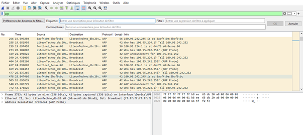
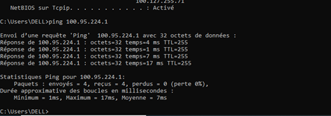
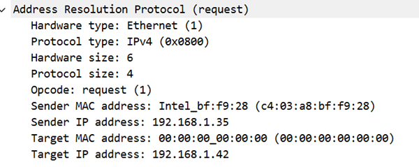
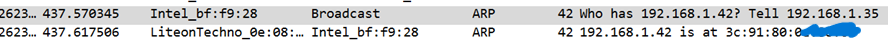
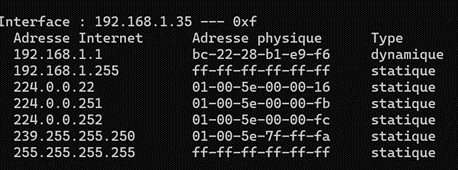
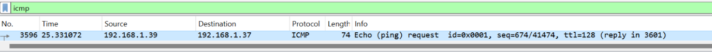
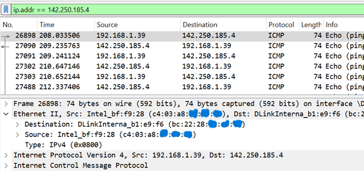

# Wireshark Network Analysis

## Overview

This repository showcases a practical network traffic analysis performed using **Wireshark**. The objective of this project was to observe how devices communicate on local and remote networks by capturing and analyzing network packets.

Through packet inspection, this project explores the behavior of key network protocols such as **ARP**, **ICMP**, and **DNS**, providing a better understanding of how modern networks operate and how these protocols can be analyzed during network troubleshooting and cybersecurity investigations.

---

## Objectives

The objectives of this project were to:

* Capture and inspect network traffic using Wireshark.
* Analyze ARP communications within a local network.
* Observe ICMP packets generated during connectivity tests.
* Understand the role of DNS in remote communications.
* Compare local and remote network traffic.
* Develop practical packet analysis skills applicable to networking and cybersecurity.

---

## Environment

| Component         | Details                           |
| ----------------- | --------------------------------- |
| Operating System  | Windows                           |
| Network Interface | Wi-Fi                             |
| Packet Analyzer   | Wireshark                         |
| Commands Used     | `ipconfig /all`, `ping`, `arp -a` |

---

# ARP Analysis

## Network Configuration

The analysis began by identifying the active network interface and collecting the local network configuration using the `ipconfig /all` command.

This information provided the IPv4 address, MAC address, and gateway required to understand subsequent packet exchanges.

---

## Capturing ARP Traffic

Wireshark was configured to capture network traffic while the `arp` display filter was applied to isolate Address Resolution Protocol packets.

To generate ARP traffic, a `ping` request was sent to another device on the local network.

---

## Packet Analysis

The capture shows an **ARP Request** broadcast across the local network to determine which device owns a specific IPv4 address.

Once the destination host receives the request, it responds with an **ARP Reply** containing its MAC address. This allows both devices to communicate at the data-link layer.

After the exchange, the operating system stores the IP-to-MAC mapping in its ARP cache, reducing the need for additional ARP requests during future communications.

### Key Observations

* ARP operates only within the local network.
* ARP Requests are broadcast to all hosts.
* ARP Replies are sent directly to the requesting host.
* The operating system stores resolved MAC addresses in the ARP cache.

---

# ICMP Analysis

The **Internet Control Message Protocol (ICMP)** was analyzed using the `ping` command to evaluate network connectivity.

## Local Communication

A first capture was performed between devices connected to the same local network.

The traffic contains **ICMP Echo Request** and **Echo Reply** packets exchanged directly between the communicating hosts.

---

## Remote Communication

A second capture targeted a remote host using its domain name.

Unlike local communications, packets are first forwarded to the default gateway before being routed across external networks.

### Key Observations

* Local devices communicate directly after ARP resolution.
* Remote communications require routing through the default gateway.
* ICMP is commonly used to verify network connectivity and diagnose communication issues.

---

# DNS Analysis

Remote connectivity using domain names, such as ping google.com, depends on the Domain Name System (DNS).

Before ICMP packets are transmitted, the operating system resolves the domain name into its corresponding IPv4 address. This name resolution process enables users to communicate with remote hosts using human-readable domain names instead of numerical IP addresses.

Understanding the role of DNS is essential when analyzing network traffic, troubleshooting connectivity issues, and investigating network communications in cybersecurity.

---

# Protocol Summary

| Protocol | Purpose                                                                |
| -------- | ---------------------------------------------------------------------- |
| ARP      | Resolves IPv4 addresses into MAC addresses on a local network.         |
| ICMP     | Tests and verifies connectivity between network devices.               |
| DNS      | Resolves domain names into IPv4 addresses before remote communication. |
| IPv4     | Provides logical addressing and routing between hosts.                 |

---

# Security Perspective

Packet analysis is a fundamental skill in cybersecurity. Understanding how common network protocols operate helps analysts distinguish legitimate traffic from suspicious activity.

Wireshark can be used to:

* investigate network incidents;
* identify abnormal network behavior;
* troubleshoot connectivity problems;
* inspect protocol communications;
* support incident response and forensic investigations.

---

# Skills Demonstrated

* Network Traffic Analysis
* Packet Capture with Wireshark
* ARP Analysis
* ICMP Analysis
* Basic DNS Understanding
* Network Troubleshooting
* Protocol Inspection
* Network Fundamentals

---

# Key Takeaways

This project strengthened my understanding of network communications by providing hands-on experience with packet capture and protocol analysis.

By analyzing ARP and ICMP traffic and understanding the role of DNS in remote communications, I gained practical knowledge of how devices communicate across networks. These concepts form an essential foundation for more advanced topics in networking and cybersecurity, including traffic analysis, incident investigation, intrusion detection, and network monitoring.
